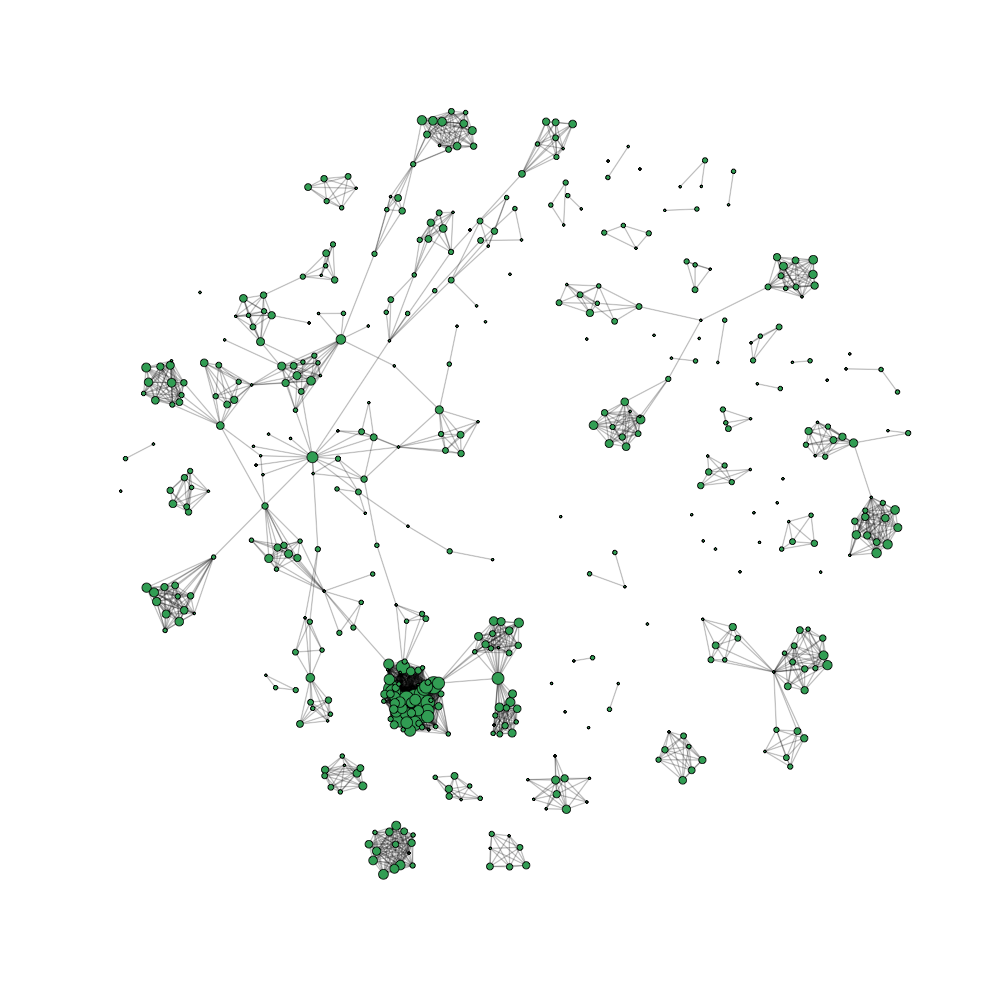

# graphlayout

[](https://travis-ci.org/lytics/graphlayout) [](https://godoc.org/github.com/lytics/graphlayout)

A Go library for computing graph layouts.



## Usage

```go
import (
  "github.com/lytics/graphlayout"
  "gonum.org/v1/gonum/mat"
)

// adjacency matrix
var adj *mat.DenseMatrix
stop := make(chan struct{})
layout, err := graphlayout.FruchtermanReingoldLayout(adj, stop, &FruchtermanReingoldConfig{
  Niter: 1000,
})
```
